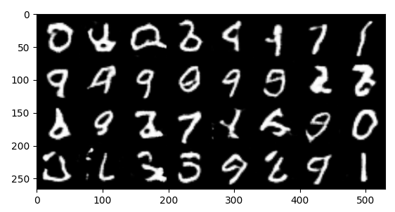
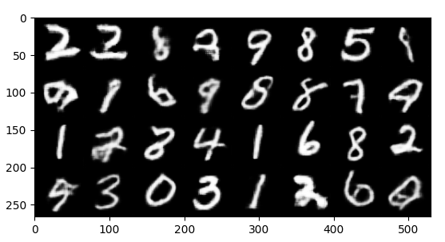

# WGAN
Implementation of WGAN in pytorch

### Installation
Install the required libraries
    
    pip install -r requirements.txt

### Usage
#### Training

    python train.py [OPTIONS]

    Options:
        --dataset_name_name dataset                                          Name of the dataset. Choices - [MNIST, FashionMNIST].
        --data_path local_dataset_directory                                  Local path containing images to be trained on. Either dataset_name or dataset_path should be provided.
        --exp_name EXP_NAME                                                  Experiment name for directory naming\.
        --no_cuda                                                            Flag for not using gpu.
        --save_dir directory_path                                            Directory for storing model checkpoints.
        --logs_dir directory_path                                            Directory for storing logs (to be used for tensorboard visualization).
        --use_gradient_penalty                                               Flag for using gradient penalty for WGAN loss
        --lr LEARNING_RATE(FLOAT)                                            Learning rate for training.
        --n_epochs EPOCHS(INT)                                               No. of epochs for training the model.
        --critic_iterations CRITIC_ITERS                                     No. of critic training iterations before 1 gneerator training itereation
        --batch_size BATCH_SIZE(INT)                                         Batch size for training.
        --image_size IMG_SIZE(INT)                                           Size of the image to be passed to the model.
        --image_channels IMG_CHANNELS(INT)                                   No of channels in the image. 1 - Grayscale 3 - Colour.
        --z_dim Z_DIM(INT)                                                   Length of the noise vector to be passed as input to the generator.
        --features_d FEATURES_D(INT)                                         Base number of feature maps in discriminator. Each conv layer has a multiple of FEATURES_D feature maps.
        --features_g FEATURES_G(INT)                                         Base number of feature maps in generator. Each conv_transpose layer has a multiple of FEATURES_G feature maps.
        --weight_clip WEIGHT_CLIP                                            Weight clip value for vanilla WGAN loss.
        --lambda_gp LAMBDA_GP                                                Weight of gradient_penalty loss in WGAN (when use_gradient_penalty is enabled).
        --optimizer OPTIMIZER                                                Type of optimizer to use. Choices - [RMSprop, Adam].

Example Usage:

    python train.py \
        --dataset_name MNIST \
        --experiment_name MNIST \
        --save_dir "models" \
        --logs_dir "logs" \
        --use_gradient_penalty \
        --lr 1e-5 \
        --n_epochs 5 \
        --critic_iterations 5 \
        --batch_size 128 \
        --image_size 64 \
        --image_channels 1 \
        --z_dim 100 \
        --gen_embed_dim 100 \
        --features_d 64 \
        --features_g 64 \
        --lambda_gp 10 \
        --optimizer Adam

#### Image Generation

    python generate_images.py [OPTIONS]

    Options:
        --model model_path                           Path containing model checkpoint (local).
        --n_images N_IMAGES(INT)                     No. of images to generate.
        --save_path directory_path                   Path + filename for storing generated image.
        --no_cuda                                    Flag for not using gpu.
        --image_channels IMG_CHANNELS(INT)                                   No of channels in the image. 1 - Grayscale 3 - Colour
        --z_dim Z_DIM(INT)                           Length of the noise vector to be passed as input to the generator.
        --features_g FEATURES_G(INT)                 Base number of feature maps in generator. Each conv_transpose layer has a multiple of FEATURES_G feature maps.

        

Example Usage:

    python generate_images.py \
        --model models/checkpoint_9.pt \
        --n_images 32 \
        --image_channels 1 \
        --save_path outputs/MNIST/generated.jpg
        --z_dim 100 \
        --features_g 64

### Results
#### MNIST
Dataset - https://yann.lecun.com/exdb/mnist

**Normal**

**With Gradient Penalty**

